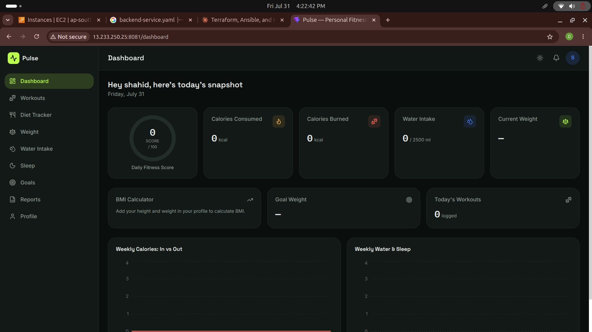

# Pulse — Fitness Tracker (MERN Stack) — Deployment Guide

This README explains the full deployment flow — first **Terraform** was
used to spin up AWS EC2 infrastructure, then that same infra was
configured with **Ansible**, then **Kind (Kubernetes in Docker)** was
installed on the EC2 instance, and finally the app was deployed to that
cluster using **Kubernetes operations**.

---

## Project Overview

Pulse is a full-stack fitness tracking app (MongoDB + Express + React +
Node). Its deployment happens in 4 stages:

1. Terraform → Provision infrastructure (EC2 instance)
2. Ansible → Configure that EC2 (install Docker, Kind, kubectl)
3. Kind → Create a Kubernetes cluster inside the EC2 instance
4. Kubectl (K8s manifests) → Deploy the app to the cluster + set up monitoring

---

## Screenshot



*(Replace the link above with your own deployment/dashboard screenshot,
e.g. `./screenshots/dashboard.png`, once you capture one from the running app.)*

---

## Stage 1 — Provisioning Infrastructure with Terraform

First, Terraform was used to provision infrastructure on AWS (EC2
instance + security group + key pair). All of this lives in the
`terraform/` folder:

```
terraform/
├── providers.tf     # AWS provider + region (ap-south-1)
├── ec2.tf           # EC2 instance, security group, key pair
└── outputs.tf       # EC2 public/private IP output
```

`ec2.tf` defines these resources:

- `aws_default_vpc` — uses the default VPC
- `aws_key_pair` — attaches the SSH key (`terrakey.pub`) to the EC2 instance
- `aws_security_group` — only allows SSH (port 22)
- `aws_instance` — a `t3.xlarge` instance with a 20GB gp3 root volume

### Terraform Commands

```bash
cd terraform

# Initialize Terraform (downloads the provider)
terraform init

# Preview what will be created
terraform plan

# Actually create the infrastructure
terraform apply -auto-approve

# Get the EC2 public IP from the output
terraform output
```

After this step, an EC2 instance is up and running on AWS, ready to be
configured in the next stage.

---

## Stage 2 — Configuring the Infra with Ansible

The EC2 instance provisioned by Terraform was then configured using
**Ansible**. Everything lives in the `ansible/` folder:

```
ansible/
├── ansible.conf        # inventory + SSH key config
├── hosts.yml             # EC2 IP + SSH user (ubuntu)
├── playbook.yml           # Installs Docker, Kind, kubectl
├── kind.yml                # Creates the Kind cluster
├── create-kind.yml          # Copies the Kind config file
├── node_exporter.yml         # Monitoring: installs Node Exporter
├── prometheus.yml             # Monitoring: installs Prometheus
└── grafana.yml                  # Monitoring: installs Grafana
```

`hosts.yml` contains the EC2 public IP (from Terraform's output), and
uses `terrakey` (the SSH key Terraform generated) to connect.

### Ansible Commands

```bash
cd ansible

# Test connectivity
ansible -i hosts.yml all -m ping

# Install Docker + Kind + kubectl on the EC2 instance
ansible-playbook -i hosts.yml playbook.yml

# Install the monitoring stack (optional)
ansible-playbook -i hosts.yml node_exporter.yml
ansible-playbook -i hosts.yml prometheus.yml
ansible-playbook -i hosts.yml grafana.yml
```

`playbook.yml` does the following:

- Updates the apt cache
- Installs Docker, starts it, and adds the `ubuntu` user to the docker group
- Detects the system architecture (amd64/arm64)
- Downloads the Kind binary (`/usr/local/bin/kind`)
- Downloads the latest kubectl (`/usr/local/bin/kubectl`)
- Verifies Docker, Kind, and kubectl versions

---

## Stage 3 — Installing Kubernetes with Kind (on EC2)

Once Ansible installed Docker and Kind, the same Ansible flow
(`kind.yml`) was used to create a local Kubernetes cluster inside the
EC2 instance:

```bash
ansible-playbook -i hosts.yml kind.yml
```

This playbook:

1. Copies the `kind.yaml` config file to the EC2 instance
2. Checks whether a cluster named `tws-cluster` already exists
3. If not, runs `kind create cluster --config=/tmp/kind.yaml`
4. Waits for the nodes to become Ready
5. Runs `kubectl get nodes -o wide` to show the cluster status

After this stage, the EC2 instance has a fully working Kubernetes
cluster running inside it (Kind = Kubernetes IN Docker).

---

## Stage 4 — Kubernetes Operations (Deploying the App)

With the cluster ready, the app was deployed using the manifests in the
`k8s/` folder:

```
k8s/
├── namespace.yaml          # Creates the "dev" namespace
├── pv.yaml                  # Persistent Volume (10Gi)
├── pvc.yaml                  # Persistent Volume Claim (4Gi)
├── mongodb.yaml                # MongoDB StatefulSet
├── mongo-service.yaml            # MongoDB headless service
├── backend.yaml                    # Backend Deployment (Node/Express)
├── backend-service.yaml              # Backend NodePort service (30050)
├── frontend.yaml                       # Frontend Deployment (React + nginx)
└── frontend-service.yaml                 # Frontend NodePort service
```

### Kubectl Commands (on EC2, via SSH)

```bash
# SSH into the EC2 instance (using the Terraform key)
ssh -i terrakey ubuntu@<EC2_PUBLIC_IP>

# Create the namespace
kubectl apply -f namespace.yaml

# Set up storage
kubectl apply -f pv.yaml
kubectl apply -f pvc.yaml

# Create the secrets (JWT_SECRET, MONGO_URI, SMTP creds, ADMIN_PASSWORD)
kubectl create secret generic fitness-secret -n dev \
  --from-literal=JWT_SECRET=<value> \
  --from-literal=MONGO_URI=<value> \
  --from-literal=SMTP_USER=<value> \
  --from-literal=SMTP_PASS=<value> \
  --from-literal=ADMIN_PASSWORD=<value>

# Deploy the database
kubectl apply -f mongodb.yaml
kubectl apply -f mongo-service.yaml

# Deploy the backend
kubectl apply -f backend.yaml
kubectl apply -f backend-service.yaml

# Deploy the frontend
kubectl apply -f frontend.yaml
kubectl apply -f frontend-service.yaml

# Check the status
kubectl get all -n dev
kubectl get pods -n dev -w
```

App components:

| Component | Type            | Namespace | Notes                          |
|-----------|------------------|-----------|---------------------------------|
| mongo     | StatefulSet      | dev       | 10Gi PVC, headless service      |
| backend   | Deployment       | dev       | NodePort 30050, port 5000       |
| frontend  | Deployment       | dev       | NodePort, port 80               |

---

## Full Flow — Summary

```
Terraform (provision infra)
      │  terraform init / plan / apply
      ▼
   AWS EC2 (Ubuntu) ready
      │
      ▼
Ansible (configure that EC2)
      │  ansible-playbook playbook.yml
      ▼
Docker + Kind + kubectl installed
      │
      ▼
Kind (create Kubernetes cluster inside EC2)
      │  ansible-playbook kind.yml
      ▼
Local K8s cluster (tws-cluster) ready
      │
      ▼
kubectl apply -f k8s/  (Namespace → PV/PVC → Mongo → Backend → Frontend)
      │
      ▼
App live on EC2 Public IP : NodePort
```

---

## Monitoring (Extra)

Ansible playbooks were also used to set up monitoring on the EC2
instance:

- **Node Exporter** — exposes system metrics (port 9100)
- **Prometheus** — scrapes/stores metrics (port 9090)
- **Grafana** — for dashboards

```bash
ansible-playbook -i hosts.yml node_exporter.yml
ansible-playbook -i hosts.yml prometheus.yml
ansible-playbook -i hosts.yml grafana.yml
```